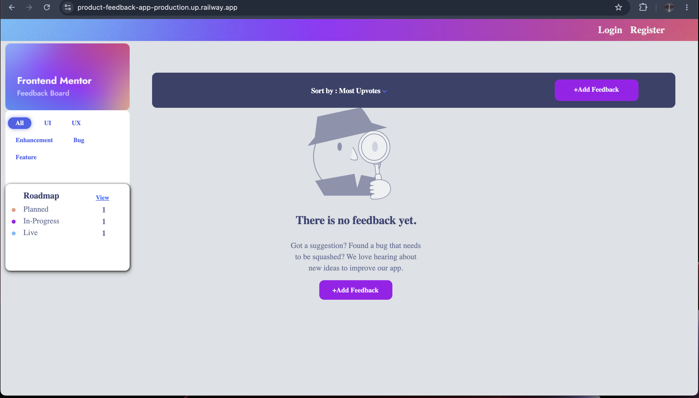
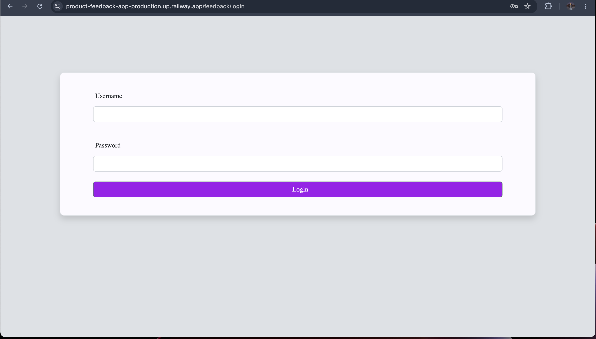
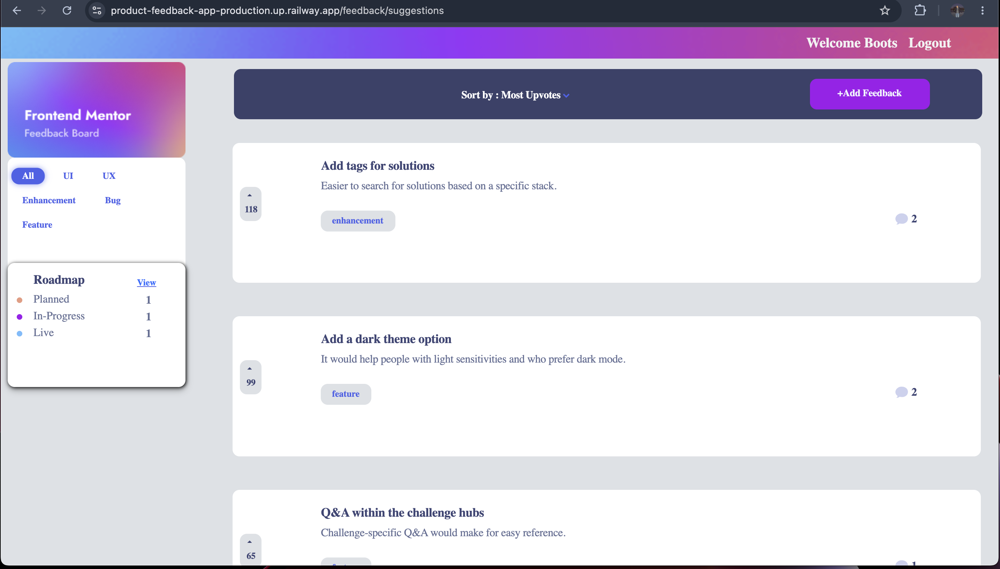
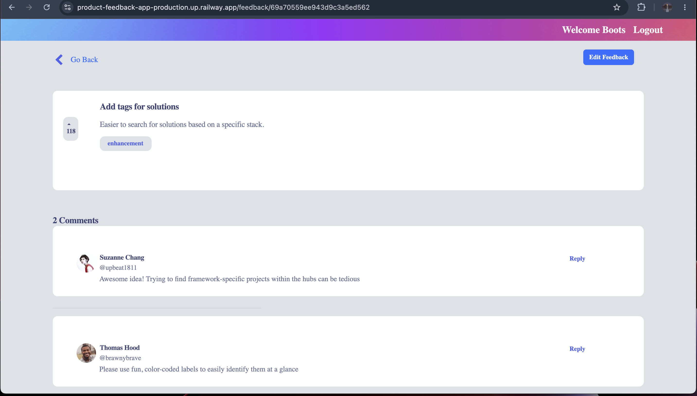
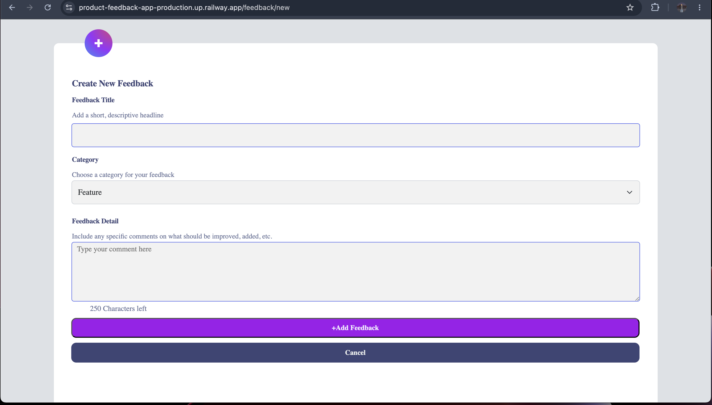
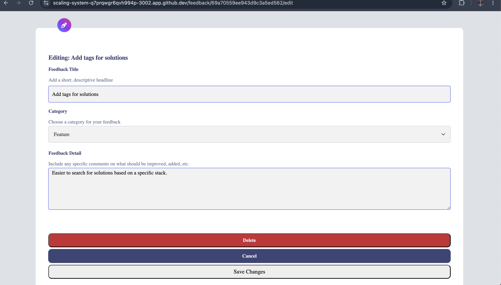
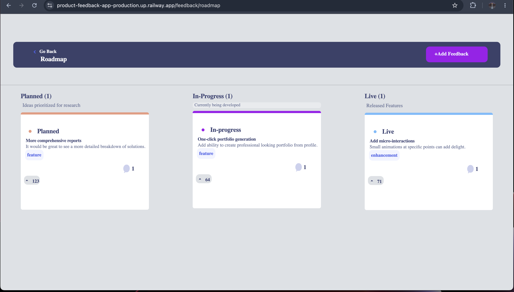

# Product Feedback App

## Overview

The **Product Feedback App** is a full-stack web application where users can submit feedback on products, comment on other users’ suggestions, reply to comments, and upvote ideas. This project demonstrates my skills in **Node.js, Express, MongoDB, Bootstrap, Cloudinary**, and **frontend-backend integration**.  

I built this project as a self-directed project to showcase real-world full-stack development, including **database design, user authentication, dynamic UI, and API integration**.

---

## Live Demo

Try the app here: [Product Feedback App Live](https://product-feedback-app-production.up.railway.app/)  

> Note: Loading might be slightly delayed due to Railway free service spin-down.

---

## Features

- User registration, login, and authentication with hashed passwords
- Create, read, update, and delete (CRUD) functionality for feedback, comments, and replies
- Upvoting system for feedback suggestions
- Sorting feedback by upvotes or number of comments
- Responsive UI built with Bootstrap
- Cloudinary integration for user-uploaded images
- Fully deployed backend on Railway

---

## My Contributions

- Designed MongoDB schemas for feedback, comments, and replies
- Implemented frontend search, sorting, and dynamic interactions using JavaScript and Bootstrap
- Integrated Cloudinary to handle user-uploaded images
- Built authentication and session management with Node.js and Express
- Collaborated using Git for version control with feature branches and pull requests
- Ensured responsive design and polished user interface

---

## Screenshots

---

## How To Use

1. Go to the live site: [Product Feedback App](https://product-feedback-app-production.up.railway.app/)  
2. Register a new account or log in with an existing one  
3. Add feedback by clicking **Add Feedback**  
4. View and comment on other users’ feedback  
5. Reply to comments by clicking **Reply**  
6. Sort feedback by **upvotes** or **number of comments**  

---

## Future Improvements

- Restrict edit/delete options to feedback authored by the logged-in user  
- Implement real-time notifications for comments and replies  
- Add AI-based sentiment analysis to feedback and comments  

---

## How To Contribute

1. Fork the repository  
2. Create a new branch for your feature or bugfix  
3. Make changes and submit a pull request  

---

## Technologies Used

- **Frontend:** HTML, CSS, Bootstrap, JavaScript  
- **Backend:** Node.js, Express.js  
- **Database:** MongoDB  
- **File Storage:** Cloudinary  
- **Version Control:** Git, GitHub  

---

## Lessons Learned

- **Denormalized Schema Architecture:** Designed an embedded subdocument strategy for the commenting engine. By nesting replies as an array directly within the Comment document, the application fetches full conversation trees in a single database read operation, significantly reducing query overhead and eliminating the need for expensive `$lookup` aggregations.
- **Third-Party API Integration:** Managed an asset pipeline with Cloudinary to handle multi-part form data and secure user-uploaded images.
- **Asynchronous Flow Control:** Handled complex asynchronous logic and middleware integration within Node.js and Express to ensure robust request-response cycles.
- **Responsive Engineering:** Built a fluid, interactive frontend utilizing JavaScript and Bootstrap to ensure state consistency across device sizes.
- **Production Deployment:** Configured environment variables and successfully managed live deployment infrastructure using Railway.

---

## License

This project is licensed under the MIT License. See the [LICENSE](./LICENSE) file for details.